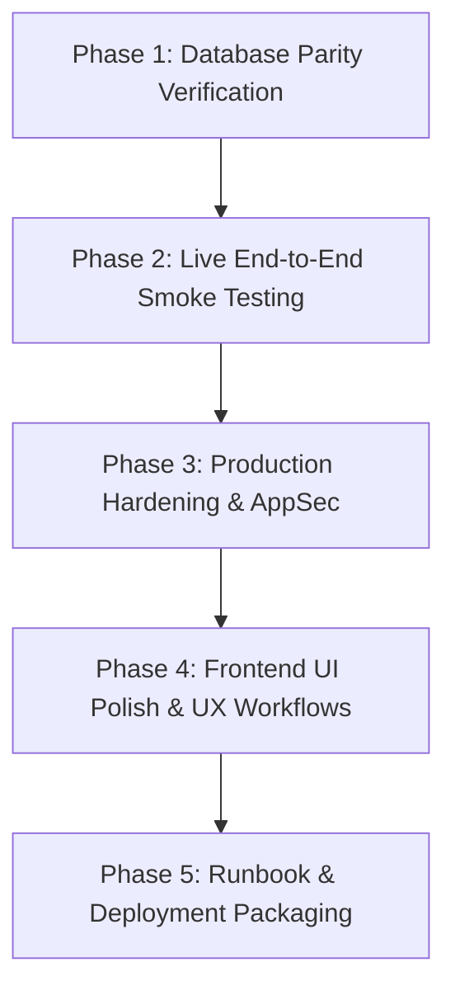

# CitiSent-Ops — Day 2 Execution Roadmap & Engineering Plan
**Document Version:** 1.0.0  
**Target Environment:** Standalone Developer & Platform Control Plane (`CitiSent-Ops`)  
**Git Branch:** `CitiDevs`  
**Baseline Commit:** `0569ce1` (*feat(ops): implement standalone CitiSent-Ops control plane and full-parity database schemas*)  
**Non-Regression Invariant:** Zero modifications to `CitiSent-Mobile/`, `CitiSent-Website/`, and `backend/`.

---

## 1. Day 1 Accomplishments Recap

During Day 1, we established the complete foundational platform for developer-driven municipal operations without violating client codebase boundaries:

1. **Air-Gapped Control Plane Architecture:**
   - Isolated platform portal under `CitiSent-Ops/` (Frontend on port `5174`, Backend on port `5001`).
   - Physical separation guaranteed that client apps (`CitiSent-Mobile`, `CitiSent-Website`, `backend`) remain 100% untouched.
   - `service_role` Supabase master key strictly confined to `CitiSent-Ops/backend`.
2. **Backend Engine (`CitiSent-Ops/backend`):**
   - Express REST API with Zod input validation, Helmet, CORS, and centralized error handling.
   - Developer Authentication: Whitelist enforcement (`DEVELOPER_ALLOWED_EMAILS`) with automatic credential sync and role elevation.
   - Superadmin Provisioning: CSPRNG 32-byte cryptographic token generation, SHA-256 hash storage, and direct setup link fallback.
   - Brevo HTTPS API integration (port 443) replacing legacy SMTP to eliminate firewall and port-blocking risks.
   - 1-Click Idempotent Municipal Department Seeder (`ON CONFLICT (slug) DO NOTHING`).
   - Immutable platform audit logging (`platform_audit_logs`).
3. **Frontend Dashboard (`CitiSent-Ops/frontend`):**
   - Modern Vite 6 + React 19 + Tailwind CSS dark-mode glassmorphic control plane.
   - Tabbed workspace: Superadmin Directory, Department Seeder, and Audit Log Viewer.
   - Fixed `opsApiClient` reference error, enriched API exception reporting in UI.
4. **Database Parity Resolution:**
   - Reverse-engineered the live schema from the existing database to identify 7 missing application tables.
   - Authored [patch_missing_tables.sql](file:///c:/Users/PROVIDENCE/OneDrive/Desktop/CitiSent/CitiSent-Ops/patch_missing_tables.sql) for 1-click in-place schema patching.
   - Updated [production_schema.sql](file:///c:/Users/PROVIDENCE/OneDrive/Desktop/CitiSent/CitiSent-Ops/production_schema.sql) to v2.0.0 (Full Parity Edition, 16 tables).
   - Cleanly committed Day 1 deliverables to the `CitiDevs` branch (`0569ce1`).

---

## 2. Skills Integration & Engineering Principles

In strict accordance with the project's engineering skills in `CitiSent-Website/skills/`:

| Skill / Domain | Engineering Mandate for Day 2 |
| :--- | :--- |
| **`architecture-and-code-quality`** | Maintain strict architectural seams. Zero coupling between Ops portal and client gateway. Pragmatism over dogma; clean modular abstractions. |
| **`backend-architect`** | Contract-first API consistency, structured JSON error payloads (`{ success, error, details }`), robust health-check endpoint, and graceful resource cleanup. |
| **`security-auditor`** | Defense in depth, least-privilege token access, brute-force rate-limiting on auth endpoints, input sanitization via Zod, and cryptographically sound token verification. |
| **`frontend-developer` & `web-design-guidelines`** | High-contrast accessibility, keyboard navigation, clear visual hierarchy, optimistic UI updates, loading skeletons, and interactive toast notifications. |
| **`database-optimizer`** | Strategic B-tree indexing for foreign keys and timestamp-ordered audit queries; idempotent batching for department and issue type seeds. |
| **`git-guardrails-claude-code`** | Non-destructive Git workflows on `CitiDevs`. Zero accidental file modifications outside `CitiSent-Ops/`. |

---

## 3. Day 2 Detailed Phased Roadmap

### Phase 1: Database Parity & Connectivity Verification
- [ ] **Task 1.1: Verify Patch Execution in Supabase**
  - Ensure [patch_missing_tables.sql](file:///c:/Users/PROVIDENCE/OneDrive/Desktop/CitiSent/CitiSent-Ops/patch_missing_tables.sql) has been run in the target Supabase SQL Editor.
  - Verify all 16 tables exist: `agencies`, `issue_types`, `profiles`, `agency_staff_users`, `reports`, `report_number_sequences`, `report_attachments`, `report_comments`, `report_messages`, `report_message_reads`, `report_status_history`, `transfer_requests`, `notifications`, `banned_users`, `admin_activity_logs`, `platform_audit_logs`.
- [ ] **Task 1.2: Database Health Verification Script**
  - Run a lightweight automated Node.js inspection script to query `select count(*)` from each table via `supabaseAdmin` to ensure zero schema or permission anomalies.

---

### Phase 2: Live End-to-End Smoke Testing
- [ ] **Task 2.1: Developer Authentication & Whitelist Enforcement**
  - Start backend (`PORT=5001`) and frontend (`PORT=5174`).
  - Log in with whitelisted developer email (`joedmadi0881@gmail.com`).
  - Validate that non-whitelisted emails are rejected with `403 Forbidden`.
- [ ] **Task 2.2: Idempotent Municipal Department & Issue Type Seeding**
  - Trigger 1-click seeding from the Ops dashboard.
  - Verify all departments insert cleanly into `agencies`.
  - Verify default issue types are seeded into `issue_types` linked by `agency_id`.
  - Re-run seeder to ensure idempotency (`ON CONFLICT DO NOTHING`, zero duplicate key crashes).
- [ ] **Task 2.3: Superadmin Provisioning & Brevo Dispatch**
  - Provision a new municipal Superadmin from the modal dialog.
  - Confirm Brevo HTTPS dispatch (or fallback to manual copy link if testing in dev mode).
  - Inspect `profiles` table to confirm `invitation_token_hash`, `account_type='superadmin'`, `activation_status='pending'`, and unique 6-digit `display_id`.
- [ ] **Task 2.4: Superadmin Activation Flow Integration**
  - Open the generated setup link in `CitiSent-Website`.
  - Complete the password activation form.
  - Verify profile switches to `activation_status='active'`.
- [ ] **Task 2.5: Emergency Operations & Audit Trail**
  - Test account suspension and re-activation from the Superadmin Directory.
  - Test emergency account unlock.
  - Verify that each operation generates a corresponding row in `platform_audit_logs` with actor email, action type, IP address, and timestamp.

---

### Phase 3: Production Hardening & AppSec (`security-auditor` & `backend-architect`)
- [ ] **Task 3.1: Rate Limiting Middleware**
  - Add `express-rate-limit` to `CitiSent-Ops/backend` to mitigate brute-force risks on:
    - `/api/v1/ops/register-dev` (max 5 requests per 15 min per IP)
    - `/api/v1/ops/superadmins` (max 30 provisioning requests per hour)
- [ ] **Task 3.2: Formal Health Check Endpoint**
  - Implement `GET /api/v1/ops/health` returning system uptime, database latency ping, and environment status.
- [ ] **Task 3.3: Enhanced Audit Log Search & Filter API**
  - Allow filtering audit logs by action type (`SUPERADMIN_PROVISIONED`, `DEPARTMENT_SEEDED`, etc.) and date range.

---

### Phase 4: Frontend UI Polish & UX Enhancements (`frontend-developer` & `web-design-guidelines`)
- [ ] **Task 4.1: Interactive Toast & Feedback Notifications**
  - Implement a dedicated Toast notification system for async actions (success, warning, error) with auto-dismiss and progress timers.
- [ ] **Task 4.2: Destructive Action Confirmation Modals**
  - Add safety confirmation modals before suspending or unlocking an admin account.
- [ ] **Task 4.3: Copy-to-Clipboard Micro-Interactions**
  - Add visual "Copied!" checkmark animations on the setup link copy button in [ProvisionSuperadminModal.jsx](file:///c:/Users/PROVIDENCE/OneDrive/Desktop/CitiSent/CitiSent-Ops/frontend/src/components/ProvisionSuperadminModal.jsx).
- [ ] **Task 4.4: Loading Skeletons & Empty States**
  - Add shimmer skeleton loaders for directory table and audit log list when fetching data.

---

### Phase 5: Runbook & Handover Documentation
- [ ] **Task 5.1: Operator Runbook (`CitiSent-Ops/RUNBOOK.md`)**
  - Step-by-step instructions for platform engineers on how to deploy, rotate keys, whitelist new engineers, and perform disaster recovery.
- [ ] **Task 5.2: Final Git Staging & Clean Commit**
  - Commit all Day 2 additions cleanly to branch `CitiDevs`.

---

## 4. Acceptance Criteria Checklist

| Deliverable | Acceptance Criteria | Status |
| :--- | :--- | :---: |
| **Schema Parity** | All 16 tables queryable without PostgreSQL relation errors | Pending Verification |
| **Developer Auth** | Whitelist correctly enforced; whitelisted engineers sign in seamlessly | Verified |
| **Department Seeder** | 1-click idempotent seeding with zero duplicate key errors | Ready for Smoke Test |
| **Superadmin Provisioning** | 32-byte crypto token generated, hashed, setup link available | Ready for Smoke Test |
| **Email Service** | Brevo HTTPS API delivers invitation emails reliably | Configured & Ready |
| **Emergency Controls** | Suspension, reactivation, and unlock toggles work instantly | Ready for Smoke Test |
| **Audit Immutability** | All actions logged to `platform_audit_logs` with actor metadata | Ready for Smoke Test |
| **Zero Blast Radius** | `CitiSent-Mobile/`, `CitiSent-Website/`, and `backend/` have 0 git changes | Guaranteed (Verified) |

---

*This roadmap serves as our active plan of record for Day 2. Each task will be checked off as we execute.*
