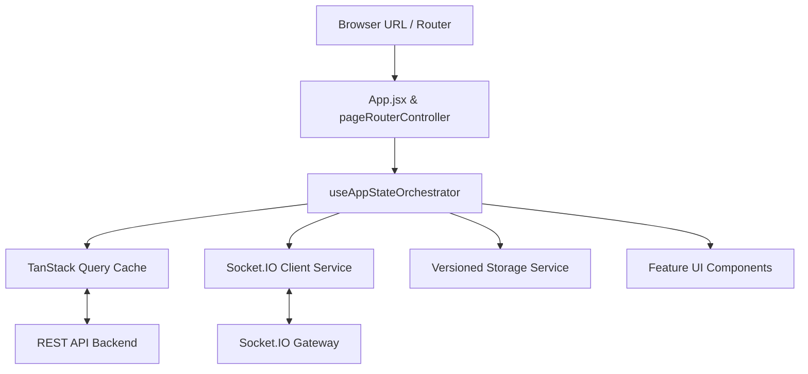

# CitiSent Web Portal

> **The Official Admin & Superadmin Dashboard for CitiSent**  
> *An Emotion-Aware City-Based Reporting System with Real-Time Sentiment Analysis*

---

## Table of Contents

- [Overview](#overview)
- [Key Features](#key-features)
  - [1. Executive Analytics & Dashboard](#1-executive-analytics--dashboard)
  - [2. Multi-Dimensional Report Management](#2-multi-dimensional-report-management)
  - [3. Real-Time Citizen Chat & Discussion Drawer](#3-real-time-citizen-chat--discussion-drawer)
  - [4. Unified Conversations Hub](#4-unified-conversations-hub)
  - [5. Citizen Directory & Profile Inspector](#5-citizen-directory--profile-inspector)
  - [6. Superadmin Agency & Admin Management](#6-superadmin-agency--admin-management)
  - [7. Profile, Preferences & Activity Audit Trail](#7-profile-preferences--activity-audit-trail)
  - [8. Offline Resilience & Connection Status](#8-offline-resilience--connection-status)
- [Technology Stack](#technology-stack)
- [Project Architecture & Directory Structure](#project-architecture--directory-structure)
- [Role-Based Access Control (RBAC)](#role-based-access-control-rbac)
- [Environment Variables](#environment-variables)
- [Getting Started & Local Setup](#getting-started--local-setup)
- [Available NPM Scripts](#available-npm-scripts)
- [State Management & Data Flow Architecture](#state-management--data-flow-architecture)
- [Testing & Quality Assurance](#testing--quality-assurance)
- [Production Build & Optimization](#production-build--optimization)
- [Contributing & Code Standards](#contributing--code-standards)

---

## Overview

**CitiSent Web Portal** is the centralized administrative dashboard for Local Government Units (LGUs), department heads, and municipal dispatchers. It empowers city administrators to triage, track, analyze, and resolve public citizen reports with sentiment awareness and real-time urgency scoring.

Powered by React 19, Vite, Tailwind CSS v4, TanStack Query v5, and Socket.IO, the portal delivers low-latency updates, bi-directional citizen messaging, AI-driven sentiment visualizations, and granular departmental access control.

---

## Key Features

### 1. Executive Analytics & Dashboard
- **Live Metric Cards**: Real-time counters for Total Reports, Pending Review, In Progress, Resolved, and Critical Incidents.
- **Sentiment & Emotion Breakdown**: Visual charts representing citizen emotion distributions (`Sad`, `Frustrated`, `Angry`, `Happy`, `Delighted`, `Neutral`, `Excited`, `Disappointed`) computed by the CitiSent AI sentiment engine.
- **Urgency Distribution**: Doughnut visualization categorizing incoming incidents by severity (`Critical`, `High`, `Medium`, `Low`).
- **7-Day Rolling Trend**: Dynamic line chart tracking report intake velocity over time.
- **Recent Reports Feed**: Quick-access incident feed with instantaneous status badges and navigation to detail views.

### 2. Multi-Dimensional Report Management
- **Categorized Views**:
  - **By Department / Agency**: Grouped by LGU agency (Barangay, Traffic Management, Sanitation & Waste, Police, Fire & Rescue, Public Works, Health Services, etc.).
  - **By Urgency Levels**: Severity-first triage queue to ensure critical emergencies are addressed immediately.
  - **Audit History**: Chronological log of all historic reports with deep filtering, pagination, and emotion chips.
- **Granular Status Lifecycle**: Update report progression seamlessly between `Pending` &rarr; `In Progress` &rarr; `Resolved` &rarr; `Unresolved`.
- **Comprehensive Report Details**: Full incident dossier including geolocation/address, timestamp, submitter identity (or anonymous mode), photo attachments, AI emotion score, description, and assigned department.

### 3. Real-Time Citizen Chat & Discussion Drawer
- **Bi-Directional Messaging**: Live WebSocket communication via Socket.IO directly between municipal admins and citizens regarding specific reports.
- **Smart Suggested Replies**: Context-aware canned responses based on report status (e.g., acknowledging receipt, dispatching field units, requesting additional photos, confirming resolution).
- **Presence & Read Receipts**: Real-time typing indicators (`Admin is typing...`), unread count badges, and automatic read acknowledgments.
- **HTTP Fallback**: Resilient automatic fallback to REST API endpoints if WebSocket connectivity is momentarily degraded.

### 4. Unified Conversations Hub
- **Dedicated Inbox**: Central inbox (`/conversations`) displaying all active citizen discussions across all reports.
- **Search & Quick Navigation**: Filter conversations by citizen name or report ID with instant drawer activation.

### 5. Citizen Directory & Profile Inspector
- **Citizen Directory**: Searchable list of registered community users with verification statuses, contact information, and registration dates.
- **User Profile View**: Detailed user profile containing their complete reporting history, resolution rate, and account activity.

### 6. Superadmin Agency & Admin Management
- **Office Admin Provisioning**: Create and onboard new departmental admins with assigned roles and credentials.
- **Agency Catalog Management**: Full CRUD capabilities for municipal agencies (Department name, code, active status, contact email, logo uploads/deletions).
- **Inter-Department Transfer Queue**: Review, approve, or reject administrative transfer requests between departments.

### 7. Profile, Preferences & Activity Audit Trail
- **Admin Profile**: Personal detail management, avatar customizer, and department reassignment request submissions.
- **Appearance & Accessibility Preferences**:
  - Theme Selection: `Dark`, `Light`, or `System` (with instant zero-flash pre-render CSS bootstrap).
  - Font Scaling: `Small` (14px), `Medium` (16px), `Large` (18px).
  - Reduced Motion Toggle: Disables heavy animations for enhanced accessibility and performance.
- **Notification Settings**: Granular toggles for email digests, critical report alerts, and transfer updates.
- **Activity Log**: Immutable chronological log recording all actions taken by the administrator during their session.

### 8. Offline Resilience & Connection Status
- **Real-Time Network Monitor**: Visual status indicator in the top navbar (`Connected`, `Reconnecting`, `Offline`).
- **Backend Unavailable Recovery**: Dedicated fallback panel (`BackendUnavailablePanel`) with one-click automatic retry and graceful logout options.
- **Skeleton Loaders**: Custom animated skeleton states (`PageSkeleton`, `TableLoader`, `NotificationSkeleton`) across all views to eliminate layout shift.

---

## Technology Stack

| Layer | Technology | Purpose |
| :--- | :--- | :--- |
| **Framework** | [React 19](https://react.dev/) | Component architecture & modern Concurrent Mode rendering |
| **Build Tool** | [Vite 7](https://vitejs.dev/) | Lightning-fast HMR, ES module bundling, and chunk splitting |
| **Styling** | [Tailwind CSS v4](https://tailwindcss.com/) | Modern utility-first CSS engine via `@tailwindcss/vite` |
| **Design System** | Custom Vanilla CSS Tokens | Dark/Light theme variables, glassmorphism, and custom scrollbars |
| **Server State & Cache** | [@tanstack/react-query v5](https://tanstack.com/query/latest) | Server caching, background refetching, and query subscriptions |
| **Real-Time WebSockets** | [Socket.IO Client v4](https://socket.io/) | Low-latency bi-directional messaging and status synchronization |
| **Alternative Realtime** | [@supabase/supabase-js](https://supabase.com/) | Realtime database subscription capabilities |
| **Charts & Visualizations** | [Chart.js](https://www.chartjs.org/) + [react-chartjs-2](https://react-chartjs-2.js.org/) | Sentiment pie charts, urgency doughnuts, and trend lines |
| **Animations** | [Framer Motion](https://www.framer.com/motion/) | Smooth drawer transitions, layout animations, and modal popups |
| **Toast Notifications** | [react-hot-toast](https://react-hot-toast.com/) + [react-toastify](https://fkhadra.github.io/react-toastify/) | Centralized toast notifications and error handling |
| **Icons** | [React Icons](https://react-icons.github.io/react-icons/) | Modern UI icons (Lucide, Heroicons, FontAwesome) |
| **Testing** | [Vitest](https://vitest.dev/) + [JSDOM](https://github.com/jsdom/jsdom) | Fast unit and integration testing suite |
| **Code Quality** | [ESLint 9](https://eslint.org/) | Code quality, React Hooks rules, and style enforcement |

---

## Project Architecture & Directory Structure

The project follows a modular **Controller-Model-View-Service** architecture designed for maintainability, testability, and separation of concerns:

```
CitiSent-Website/
├── public/                     # Static assets (favicons, logos, placeholders)
├── src/
│   ├── components/             # Reusable UI component modules
│   │   ├── Account-Ui/         # Profile & account management UI components
│   │   ├── AdminManagement-Ui/ # Agency catalog, admin tables, transfer modals
│   │   ├── Auth-Ui/            # Login, password reset & authentication forms
│   │   ├── Dashboard-Ui/       # Stat cards, pie charts, vertical charts, pills
│   │   ├── Notifications-Ui/   # Notification items, empty states, skeletons
│   │   ├── Reports-Ui/         # Report detail, agency cards, chat drawer, filters
│   │   ├── Settings-Ui/        # Appearance controls, font size, digest toggles
│   │   ├── Users-Ui/           # Citizen lists, user cards, verification badges
│   │   └── ui/                 # Base primitives (Navbar, Dropdown, Skeletons, Modal)
│   ├── controllers/            # Pure domain business logic & navigation rules
│   │   ├── accessControlController.js
│   │   ├── adminManagementController.js
│   │   ├── appearanceController.js
│   │   ├── authController.js
│   │   ├── dashboardController.js
│   │   ├── departmentTransferController.js
│   │   ├── navigationController.js
│   │   ├── notificationsController.js
│   │   ├── pageRouterController.jsx   # Dynamic code-split lazy page loader
│   │   ├── profileController.js
│   │   ├── reportAccessController.js
│   │   ├── reportStateController.js
│   │   ├── reportStatusController.js
│   │   └── userReportsController.js
│   ├── frontend/               # Top-level page views and routed screens
│   │   ├── Conversations/      # Centralized conversations inbox & discussion items
│   │   ├── Pages/              # Dashboard, AdminManagement, Notifications, Settings, Profile
│   │   ├── Reports/            # ByCategory, ByUrgencyLevels, History, Reports master
│   │   └── Users/              # Citizen User directory and UserProfilePage
│   ├── hooks/                  # Custom React state orchestration hooks
│   │   ├── useAdminAccountsState.js
│   │   ├── useAdminManagementState.js
│   │   ├── useAdminTransferState.js
│   │   ├── useAppStateOrchestrator.js # Master state coordinator for the app
│   │   ├── useAuthSession.js          # Authentication state and token lifecycle
│   │   ├── useConversationsState.js   # Conversation feeds and active thread state
│   │   ├── useDepartmentState.js      # Department catalog & options
│   │   ├── useModalAccessibility.js   # Keyboard trapping & focus management
│   │   ├── useNotificationsState.js   # Admin notification counters and actions
│   │   ├── useReportDetailState.js    # Single report fetch, mutation, and updates
│   │   ├── useReportFeedRealtime.js   # Real-time report feed synchronization
│   │   └── useUsersState.js           # Citizen user queries and filtering
│   ├── models/                 # Data contracts, schema normalizers & role models
│   │   ├── contracts.js               # JSDoc type specifications
│   │   ├── nameModel.js               # Name formatting utilities
│   │   ├── pageModel.js               # Route paths and page key constants
│   │   ├── reportStatusModel.js       # Report status & emotion badge mappings
│   │   ├── roleAccessModel.js         # RBAC definitions (Superadmin vs Office Admin)
│   │   └── storage/                   # Versioned LocalStorage schemas & normalizers
│   ├── services/               # External APIs, sockets, and data persistence
│   │   ├── api/
│   │   │   ├── admin/                 # Reports, users, departments, activity APIs
│   │   │   ├── auth/                  # Auth login, session verification APIs
│   │   │   └── core/                  # Base apiClient (fetch wrapper) & apiConfig
│   │   ├── realtime/                  # Supabase Realtime helpers
│   │   ├── socket/                    # Socket.IO client singleton & room managers
│   │   └── storageService.js          # Schema-versioned LocalStorage persistence
│   ├── utils/                  # Input validation and sanitization helpers
│   ├── App.jsx                 # Root authenticated application boundary
│   ├── index.css               # Tailwind CSS imports and theme design system
│   └── main.jsx                # React root mount with React Query Provider
├── index.html                  # HTML template with instant theme-detection script
├── package.json                # Dependencies and project scripts
├── vite.config.js              # Vite configuration with vendor chunking
└── vercel.json                 # SPA single-page routing rewrite rules
```

---

## Role-Based Access Control (RBAC)

CitiSent enforces strict role-based access control across all frontend views and API requests:

| Feature / Page | Superadmin | Office Admin | Notes |
| :--- | :---: | :---: | :--- |
| **Dashboard (`/dashboard`)** | Full Access | Department Scoped | Office admins view metrics tailored to their agency |
| **Reports Management (`/reports/*`)** | All Agencies | Assigned Agency | Superadmins can filter across all city departments |
| **Report Details & Status Updates** | Full Access | Assigned Agency | Admins can transition report statuses and chat |
| **Report Live Chat / Discussions** | Full Access | Assigned Agency | Live bi-directional Socket.IO communication |
| **Conversations Inbox (`/conversations`)**| Full Access | Assigned Agency | Real-time messages across active reports |
| **Citizen Users Directory (`/users`)** | Full Access | Full Access | View citizen profiles and incident history |
| **Admin Management (`/admin-management`)**| Full Access | Restricted | Create admins, manage department catalog |
| **Agency Catalog CRUD & Logos** | Full Access | Restricted | Modify agencies, active flags, and branding |
| **Transfer Request Approval Queue** | Full Access | Restricted | Review and decide on department transfers |
| **Admin Profile & Settings** | Full Access | Full Access | Manage individual preferences, submit transfers |
| **Notifications Center** | Full Access | Full Access | Targeted notifications per admin user |

---

## Environment Variables

Create a `.env` (or `.env.local`) file in the `CitiSent-Website` directory to configure environment endpoints:

```env
# Backend API Base URL (Defaults to http://localhost:4000/api/v1 if omitted)
VITE_API_BASE_URL=http://localhost:4000/api/v1

# Optional: Supabase Realtime Configuration (if using direct Supabase channels)
VITE_SUPABASE_URL=https://your-project.supabase.co
VITE_SUPABASE_ANON_KEY=your-anon-key
```

---

## Getting Started & Local Setup

### Prerequisites
- **Node.js**: Version `18.0.0` or higher
- **NPM**: Version `9.0.0` or higher
- **Docker**: (Optional, recommended) For running the Redis container used by the backend

### Step-by-Step Installation

1. **Navigate to the Website Directory:**
   ```powershell
   cd CitiSent-Website
   ```

2. **Install Dependencies:**
   ```powershell
   npm install
   ```

3. **Start the Complete Development Stack (Unified Command):**
   ```powershell
   npm run dev
   ```
   *This command starts Docker Redis, spins up the backend server in a separate window, and launches the Vite development server.*

4. **Alternatively, Run Only the Website:**
   ```powershell
   npm run dev:web
   ```
   *The development server will be accessible at `http://localhost:5173`.*

---

## Available NPM Scripts

| Script | Command | Description |
| :--- | :--- | :--- |
| `npm run dev` | `npm run dev:redis && ... && vite` | Spins up Redis + Backend server + Vite dev server |
| `npm run dev:web` | `vite` | Runs only the Vite frontend dev server (port 5173) |
| `npm run dev:backend`| `npm --prefix ../backend run dev` | Runs only the Express backend server from this folder |
| `npm run dev:redis` | `docker compose -f ..\docker-compose.yml up -d redis` | Starts the Redis container in Docker |
| `npm run build` | `vite build` | Compiles and optimizes assets into `dist/` |
| `npm run preview` | `vite preview` | Locally serves the production build for testing |
| `npm test` | `vitest run` | Runs all Vitest unit and integration test suites |
| `npm run test:watch` | `vitest` | Runs Vitest in interactive watch mode |
| `npm run lint` | `eslint .` | Runs ESLint 9 across all JS/JSX files |

---

## State Management & Data Flow Architecture

CitiSent-Website utilizes a layered state management approach to ensure high performance and zero unnecessary re-renders:



1. **State Orchestrator (`useAppStateOrchestrator`)**: Unifies session authentication, navigation, notifications, active report selection, and department catalog into a single coherent state interface.
2. **Server State Caching (`@tanstack/react-query`)**: Handles caching, automatic background invalidation, and deduplication of API requests for reports, users, admin accounts, and statistics.
3. **Real-Time Gateway (`socketService`)**: Maintains an authenticated singleton Socket.IO connection for live chat rooms, typing notifications, and read receipts.
4. **Schema-Versioned Persistence (`storageService`)**: Wraps `localStorage` with versioned envelopes to ensure seamless schema migrations without breaking user sessions or cached preferences.
5. **Pre-Paint Theme Resolver**: Inlines an execution script in `index.html` to prevent Dark/Light mode theme flashing before the React application mounts.

---

## Testing & Quality Assurance

The web application includes comprehensive test coverage using **Vitest** and **JSDOM**:

- **Unit Tests**: Controllers, schema validators, utility mappers, and role permission policies.
- **Hook Tests**: `useAuthSession`, `useAdminTransferState`, `useReportDetailState`, `useNotificationsState`, `useConversationsState`, and `useReportFeedRealtime`.
- **Component Tests**: Modals, dropdowns, table loaders, chat drawer interactions, and forms.

Run the test suite:
```powershell
npm test
```

---

## Production Build & Optimization

The build process is configured with Rollup chunk splitting in `vite.config.js` to ensure minimal initial bundle size and rapid page loading:

- **`react-vendor`**: Core React 19 runtime and scheduling.
- **`motion-vendor`**: Framer Motion animation engine.
- **`charts-vendor`**: Chart.js and React-Chartjs-2 visualization libraries.
- **`ui-vendor`**: Toast notifications, icons, and lightweight UI helpers.
- **`vendor`**: General utility dependencies.

Build the application for production:
```powershell
npm run build
```

Deploying to SPA hosts (like Vercel, Netlify, or Nginx) is pre-configured via `vercel.json` to handle client-side HTML5 history rewrites.

---

## Contributing & Code Standards

1. Follow the established directory layout: Place UI components in `components/`, domain logic in `controllers/`, and API interactions in `services/api/`.
2. Ensure all newly added state hooks and controllers have matching unit tests under `__tests__/`.
3. Run `npm test` and `npm run lint` before committing any code changes.
4. Maintain accessibility standards: Ensure modal dialogs support keyboard trapping (`Escape`, `Tab`) via `useModalAccessibility`.
